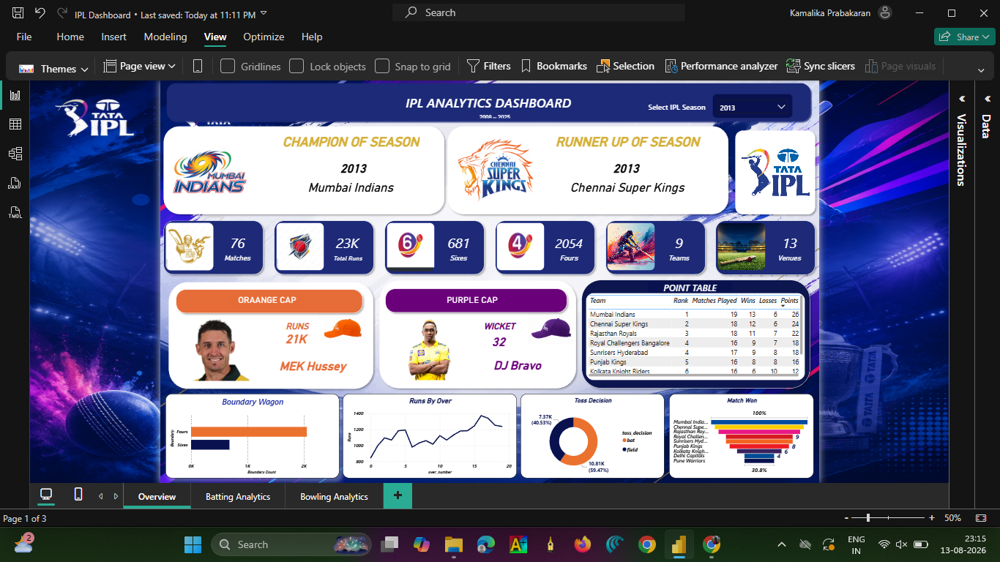

<div align="center">

# 🏏 IPL Performance Analytics Dashboard

### An interactive Power BI dashboard that turns raw IPL match data into rich, explorable insights on teams, batting, and bowling performance across seasons.

[](https://powerbi.microsoft.com/)
[](https://learn.microsoft.com/en-us/dax/)
[](https://www.microsoft.com/en-us/microsoft-365/excel)

</div>

---

## 📌 Overview

The **IPL Performance Analytics Dashboard** is a Power BI project built to explore Indian Premier League (IPL) data through a clean, interactive analytics experience. It covers team standings, batting performance, bowling performance, and award races (Orange Cap / Purple Cap) — all filterable by season — so trends and standout performances are easy to spot at a glance.

This project was built to practice and showcase real-world **data cleaning, modeling, DAX, and dashboard design** skills using a familiar, high-energy dataset.

---

## 📊 Dashboard Preview

### Overview
Season summary, team performance comparison, and points table at a glance.



### Batting Analytics
Deep dive into run-scoring trends, top performers, and the Orange Cap race.


### Bowling Analytics
Wicket-taking trends, top bowlers, and the Purple Cap race.


---

## ✨ Features

- 📅 **Interactive season filtering** — slice every page by IPL season
- 🏆 **Points table & team comparison** — see how teams stack up
- 🏏 **Batting performance analysis** — runs, strike rate, top scorers
- 🎯 **Bowling performance analysis** — wickets, economy, top bowlers
- 🟠 **Orange Cap analysis** — leading run-scorers by season
- 🟣 **Purple Cap analysis** — leading wicket-takers by season
- 💥 **Boundary analysis** — fours and sixes breakdown
- 📈 **Runs and wickets trends** across matches and seasons

---

## 🛠️ Tech Stack

| Tool | Purpose |
|------|---------|
| **Power BI** | Dashboard building & interactive visualization |
| **DAX** | Custom measures and calculated logic |
| **Excel** | Source data preparation & cleaning |

---

## 📁 Project Structure

```
IPL-Performance-Analytics-Dashboard/
├── Dashboard/
│   └── IPL Dashboard.pbix        # Power BI report file
├── Screenshots/
│   ├── overview.png
│   ├── batting analysis.png
│   └── bowling analysis.png
└── README.md
```

---

## 🚀 Getting Started

Want to explore the dashboard yourself? Here's how:

1. **Install Power BI Desktop** — [Download here](https://powerbi.microsoft.com/en-us/desktop/) (free).
2. **Clone this repository**
   ```bash
   git clone https://github.com/kamalikaprabakaran/IPL-Performance-Analytics-Dashboard.git
   ```
3. **Open the report**
   Navigate to the `Dashboard` folder and open `IPL Dashboard.pbix` in Power BI Desktop.
4. **Explore**
   Use the season filters and slicers on each page to dig into the data.

---

## 🧠 Key Skills Demonstrated

- Data cleaning & preprocessing
- Data modeling (relationships, star schema thinking)
- DAX measures & calculated columns
- Interactive dashboard design (UX for filtering & drill-down)
- Data visualization best practices
- Analytical storytelling with sports data

---

## 🔮 Future Enhancements

- Player-vs-player head-to-head comparison view
- Venue-wise performance analysis
- Integration with live/updated IPL season data
- Predictive insights (e.g., win probability trends)

---

## 🙋‍♀️ Author

**Kamalika Prabakaran**
📎 [GitHub Profile](https://github.com/kamalikaprabakaran)

If you found this project interesting, consider giving it a ⭐ — it helps a lot!

</div>
